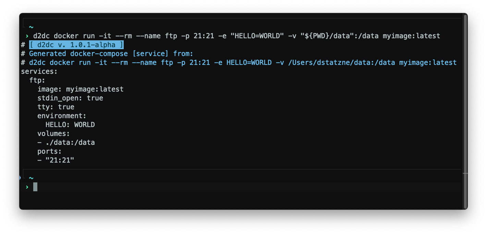

# d2dc
**D**ocker **2** **D**ocker-**C**ompose


[](https://github.com/darmiel/d2dc/actions/workflows/go-build.yml)

---

d2dc converts a `docker run`-command into a docker-compose service (see [example](#example)).


---

* [Example](#example)
* [Build](#build)
    + [Prerequisites](#prerequisites)
    + [Build](#build-1)
* [Why?](#why-)

---

## Example

**INPUT:**
```bash
$ docker run -it --rm --name ftp -p 21:21 -e "HELLO=WORLD" -v "${PWD}/data":/data myimage:latest
```

**OUTPUT:**
```bash
services:
  ftp:
    image: myimage:latest
    stdin_open: true
    tty: true
    environment:
      HELLO: WORLD
    volumes:
    - ./data:/data
    ports:
    - "21:21"
```

## Build
### Prerequisites
* Go 1.15+
* Git (or just download the tarball [here](https://github.com/darmiel/d2dc/archive/refs/heads/main.tar.gz))

### Build
Build builds the project and outputs the executable file in the root folder

```bash
$ git clone https://github.com/darmiel/d2dc
$ cd d2dc
$ go build ./cmd/d2dc

# (optional): Install to path:
$ go install ./cmd/d2dc
```

## Why?
I wanted to learn a bit of the commands for `docker run` and so I thought this would be a good project to learn those commands.